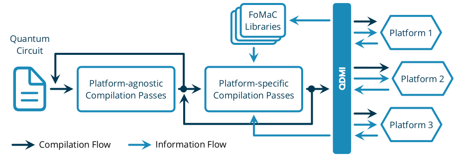

<!--
  Part of the MQSS Project, under the Apache License v2.0 with LLVM Exceptions.
  See https://llvm.org/LICENSE.txt for license information.
  SPDX-License-Identifier: Apache-2.0 WITH LLVM-exception
-->

> [!IMPORTANT]
> The Quantum Device Management Interface (QDMI) is experimental at this stage, and significant changes, including breaking changes, are anticipated in upcoming releases.

# QDMI — Quantum Device Management Interface (QDMI)

The Quantum Device Management Interface (QDMI) is the central part of the Munich Quantum Software Stack (MQSS)—a sophisticated software stack to connect end users to the wide range of possible quantum backends.
It enables software tools to automatically retrieve and adapt to changing physical characteristics and constraints of different platforms.
QDMI strives to connect the software and hardware developers, mediating between their competing interests, and eventually providing corresponding figures of merits and constraints to be considered.
QDMI is therefore the method of choice for integrating new platforms or software tools into the MQSS.
QDMI is provided as a C header file to allow fast integration into an HPC environment and consists of four main components:

- **QDMI Core**: Provides core functionality to manage sessions as well as to open and close connections to devices.
- **QDMI Control**: Enables the control of the quantum device. One can submit quantum circuits, control the job queue, and readout measurement results.
- **QDMI Device**: Provides device handling functionality like initiating the calibration or checking the status of the device.
- **QDMI Query**: Allows querying properties of the device, e.g., supported gates, error rates, gate duration, etc.

> [!IMPORTANT]
> The Quantum Device Management Interface (QDMI) is in an active development phase.
> Our development process is open to the community, encouraging contributions and feedback.
> Please be aware that QDMI is experimental at this stage, and significant changes, including breaking changes, are anticipated in upcoming releases.
> We value your input and invite you to participate in shaping QDMI's future.
> For the latest updates and to contribute, visit our [issues page](https://github.com/Munich-Quantum-Software-Stack/QDMI/issues).

## FAQ

### What is MQSS?

**MQSS** stands for *Munich Quantum Software Stack* employed at the *LRZ* developed in collaboration with the *Chair of Design Automation (CDA)* and *Chair for Computer Architecture and Parallel Systems (CAPS)* at TUM.
It facilitates the connection between end-users and quantum computing platforms by its integration within HPC infrastructures, such as those found at the LRZ.

### What is QDMI?

**QDMI** , or *Quantum Device Management Interface*, serves as the communication interface between software within the MQSS and the quantum hardware connected to the MQSS.
The aim is to provide a standard way to communicate with quantum resources that can be widely used by the whole quantum community.

### Who is using QDMI?

QDMI will be the default communication channel within the MQSS, meaning all hardware and software tools integrated into the MQSS will have to support QDMI.
Moreover, tools implementing QDMI can also be seemlessly integrated in other software stacks understanding QDMI.

### Where is the code?

The code is publicly available hosted on GitHub at [github.com/Munich-Quantum-Software-Stack/QDMI](https://github.com/Munich-Quantum-Software-Stack/QDMI).

### How can I contribute?

The preferred way to contribute is to fork the main repository on GitHub, create a new branch, and submit a pull request.
Feature requests and bug reports can be submitted via the [issues page](https://github.com/Munich-Quantum-Software-Stack/QDMI/issues).
If you'd simply like to discuss some aspect or feel unsure about your contribution, please feel free to start a discussion on the [discussions page](https://github.com/Munich-Quantum-Software-Stack/QDMI/discussions).

### Under which license is QDMI released?

QDMI is released under the Apache License v2.0 with LLVM Exceptions.
See [LICENSE](LICENSE) for more information.
Any contribution to the project is assumed to be under the same license.

### Why is it written in C and not in Python?

The interface is written in C to allow close integration within the MQSS and fulfill the performance as well as stability requirements of such an HPC system.

### Can I still integrate my Python code?

Python natively allows calling C APIs.
So while it might not be as straightforward as the usage from C/C++, it is definitely possible.

## Contact

The development of this project is led by [Laura Schulz](mailto:laura.schulz@lrz.de) (LRZ), [Martin Schulz](mailto:martin.w.j.schulz@tum.de) (TUM CAPS), and [Robert Wille](mailto:robert.wille@tum.de) (TUM CDA) on the management side
and [Lukas Burgholzer](mailto:lukas.burgholzer@tum.de) (TUM CDA) as well as [Jorge Echavarria](mailto:jorge.echavarria@lrz.de) (LRZ) from the technical side.

Please try to use the publicly accessible GitHub
channels ([issues](https://github.com/Munich-Quantum-Software-Stack/QDMI/issues), [discussions](https://github.com/Munich-Quantum-Software-Stack/QDMI/discussions), [pull requests](https://github.com/Munich-Quantum-Software-Stack/QDMI/pulls))
to allow for a transparent and open discussion as much as possible.
