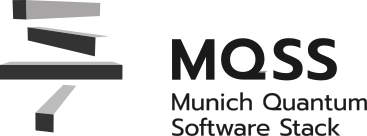
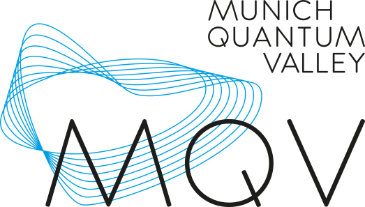
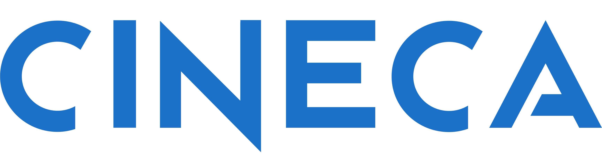
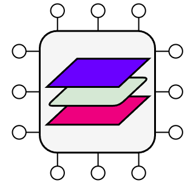
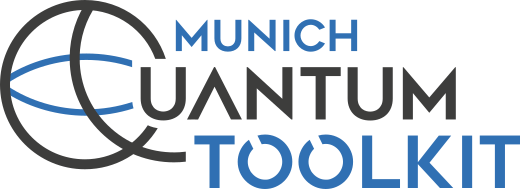
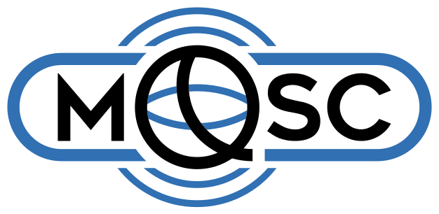
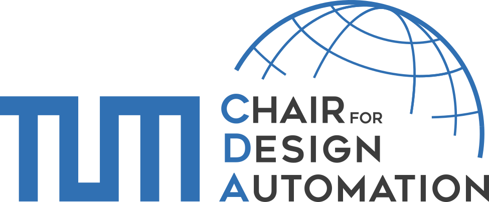
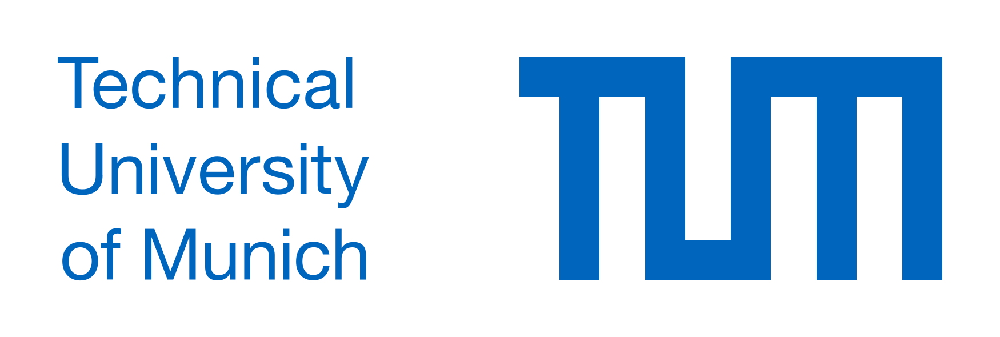

# Ecosystem and Community

QDMI is an open, vendor-neutral, standardized interface for integrating quantum
devices into classical software and infrastructure. Its international
standardization effort brings together software developers, hardware providers,
computing centres, and cloud services. The relationships below describe concrete
deployments, implementations, and collaborative work; participation is open
worldwide.

\tableofcontents

## From Munich Origins to International Collaboration {#ecosystem-reach}

### Munich: Origins and Deployment

QDMI grew out of the Munich Quantum Valley initiative. It is used at the
[Leibniz Supercomputing Centre (LRZ)](https://www.lrz.de) and
[Munich Quantum Valley gGmbH](https://www.munich-quantum-valley.de) as part of
the
[Munich Quantum Software Stack (MQSS)](https://www.munich-quantum-valley.de/research/research-areas/mqss).
MQSS connects applications, compilation, resource management, and quantum
devices. The [MQSS publication][mqss-paper] describes the stack's architecture
and its deployment at LRZ, including access to AQT and IQM systems.

  <a href="https://www.munich-quantum-valley.de/research/research-areas/mqss">MQSS</a>
  <a href="https://www.lrz.de">LRZ</a>
  <a href="https://www.munich-quantum-valley.de">Munich Quantum Valley</a>

### Germany: FullStaQD Reference Architecture

The German [FullStaQD consortium](https://github.com/FullStaQD/architecture)
develops a reference architecture for the complete quantum software stack. Its
[building-block view][fullstaqd-architecture] selects QDMI's job and query
interfaces for the reference implementation's boundary between the system and
physical layers. This extends QDMI's role beyond the MQSS stack into national
reference-architecture work.

  <a href="https://github.com/FullStaQD/architecture">FullStaQD</a>

### Europe: EuroHPC and EQS3 Integration Work

QDMI participates in integration work around EuroHPC quantum systems and the
European Quantum Systems and Software Summit (EQS3) working groups. It is being
explored at European centres hosting quantum computers to connect quantum
devices with HPC software and resource management. This work spans
[LRZ](https://www.lrz.de), the
[Poznań Supercomputing and Networking Center (PSNC)](https://www.psnc.pl), the
[Galicia Supercomputing Center (CESGA)](https://www.cesga.es),
[CINECA](https://www.cineca.it/), and
[VTT Technical Research Centre of Finland](https://www.vttresearch.com/en).
CINECA and VTT host IQM systems, connecting these efforts to the hardware
integration described below.

  <a href="https://www.lrz.de">LRZ</a>
  <a href="https://www.psnc.pl">PSNC</a>
  <a href="https://www.cesga.es">CESGA</a>
  <a href="https://www.cineca.it/">CINECA</a>
  <a href="https://www.vttresearch.com/en">VTT</a>

### Beyond Europe: openQSE

QDMI is being explored within the international
[open Quantum-HPC Software Ecosystem (openQSE)](https://openqse.org/) initiative
hosted by [Oak Ridge National Laboratory (ORNL)](https://www.ornl.gov/). The
[openQSE survey][openqse-paper] examines QDMI among the interfaces relevant to
interoperable quantum–HPC stacks and proposes a reference architecture.

  <a href="https://openqse.org/">openQSE</a>
  <a href="https://www.ornl.gov/">Oak Ridge National Laboratory</a>

## Implementations and Integrations {#ecosystem-implementations}

A QDMI interface version defines the contract between a driver and device
libraries. Implementations determine available devices, accepted program
formats, authentication, results, and deployment options. Select compatible
versions using each project's documentation and the
[QDMI compatibility guidance](rationale.md).

### Hardware, Cloud Services, and Simulators {#ecosystem-devices}

QDMI devices cover three kinds of execution target: **hardware integrations**,
**cloud access**, and **simulators**. The following examples share the same
interface while retaining their own capabilities and deployment requirements.

| System or Provider                                                                                   | QDMI integration                                                                                                                                                                                                                                                                                                                                  |
| ---------------------------------------------------------------------------------------------------- | ------------------------------------------------------------------------------------------------------------------------------------------------------------------------------------------------------------------------------------------------------------------------------------------------------------------------------------------------- |
| [IQM](https://iqm.tech/)                                                                             | **Hardware.** [QDMI-on-IQM](https://github.com/iqm-finland/QDMI-on-IQM) connects to IQM systems for architecture and calibration queries and job execution. See the [integration study][iqm-paper] and [deployment guide](https://iqm-finland.github.io/QDMI-on-IQM/).                                                                            |
| [Amazon Web Services (AWS)](https://aws.amazon.com/braket/)                                          | **Cloud access.** The [Amazon Braket QDMI device](https://github.com/munich-quantum-software/amazon-braket-qdmi-device) connects to gate-model QPUs and simulators through Amazon Braket. See the [cloud integration study][braket-paper] and [configuration and deployment guides](https://amazon-braket-qdmi-device.readthedocs.io/en/latest/). |
| [DDSIM](https://mqt.readthedocs.io/projects/core/en/latest/qdmi/ddsim_device.html)                   | **Simulator.** The DDSIM QDMI device bundled with [MQT Core](https://github.com/munich-quantum-toolkit/core) executes quantum circuits locally using decision diagrams. Start with the [executable simulator tutorial](https://mqt.readthedocs.io/projects/core/en/latest/tutorials/qdmi_execution.html).                                         |
| [IBM Quantum](https://www.ibm.com/quantum)                                                           | **Hardware.** The [IBM QDMI device](https://github.com/munich-quantum-software/ibm-qdmi-device) connects to IBM Quantum Platform. See its [installation and integration guides](https://ibm-qdmi-device.readthedocs.io/en/latest/).                                                                                                               |
| [AQT](https://www.aqt.eu/)                                                                           | **Hardware.** Trapped-ion hardware integration.                                                                                                                                                                                                                                                                                                   |
| [planqc](https://planqc.eu/)                                                                         | **Hardware.** Neutral-atom hardware integration.                                                                                                                                                                                                                                                                                                  |
| [Walther-Meißner-Institut (WMI)](https://www.wmi.badw.de/) / [Peak Quantum](https://peakquantum.de/) | **Hardware.** Superconducting hardware integration.                                                                                                                                                                                                                                                                                               |
| [Eviden Qaptiva](https://eviden.com/)                                                                | **Simulator.** The [Qaptiva QDMI device][suite-qaptiva] in the MQSS QDMI Devices Suite submits circuits to the Qaptiva emulator through myQLM.                                                                                                                                                                                                    |
| [MQSS at LRZ](https://www.lrz.de)                                                                    | **Hardware access through MQSS.** The [LRZ QDMI device][suite-lrz] in the MQSS QDMI Devices Suite submits programs to configured MQSS resources through the MQSS client.                                                                                                                                                                          |

  <a href="https://iqm.tech/">IQM</a>
  <a href="https://aws.amazon.com/braket/">Amazon Web Services</a>
  <a href="https://github.com/munich-quantum-toolkit/core">DDSIM in MQT Core</a>
  <a href="https://www.ibm.com/quantum">IBM Quantum Platform</a>
  <a href="https://www.aqt.eu/">AQT</a>
  <a href="https://planqc.eu/">planqc</a>
  <a class="qdmi-logo-dark-background" href="https://www.wmi.badw.de/">WMI</a>
  <a href="https://peakquantum.de/">Peak Quantum</a>
  <a href="https://eviden.com/">Eviden Qaptiva</a>
  <a href="https://www.lrz.de">MQSS at LRZ</a>

### Software

#### MQT Core

  <a href="https://github.com/munich-quantum-toolkit/core">MQT Core</a>

[MQT Core](https://github.com/munich-quantum-toolkit/core) connects
applications, compilation, and infrastructure to QDMI devices. Its
[QDMI guides](https://mqt.readthedocs.io/projects/core/en/latest/qdmi/index.html)
cover the following facilities:

| Component                                                                                                              | Role in the stack                                                                                    |
| ---------------------------------------------------------------------------------------------------------------------- | ---------------------------------------------------------------------------------------------------- |
| [Driver](https://mqt.readthedocs.io/projects/core/en/latest/qdmi/driver.html)                                          | Loads QDMI device libraries and manages configured devices through the Client Interface.             |
| [C++ abstraction](https://mqt.readthedocs.io/projects/core/en/latest/qdmi/driver.html)                                 | Owning wrappers for sessions, devices, and jobs, with support for replaceable QDMI drivers.          |
| [Python bindings](https://mqt.readthedocs.io/projects/core/en/latest/tutorials/qdmi_execution.html)                    | Discover devices, query capabilities, submit programs, and retrieve results from Python.             |
| [Qiskit adapter](https://mqt.readthedocs.io/projects/core/en/latest/qdmi/qdmi_backend.html)                            | Provides a Qiskit backend for circuit execution through QDMI devices.                                |
| [PennyLane adapter](https://mqt.readthedocs.io/projects/core/en/latest/qdmi/pennylane_device.html)                     | Provides a PennyLane device for QDMI execution.                                                      |
| [Slurm integration](https://mqt.readthedocs.io/projects/core/en/latest/qdmi/slurm.html)                                | Connects QDMI device access with HPC resource allocation and job workflows.                          |
| [MQT Compiler Collection integration](https://mqt.readthedocs.io/projects/core/en/latest/mlir/target_compilation.html) | Queries target capabilities and compiles compatible programs for subsequent submission through QDMI. |

JSON manifests, discovery helpers, bindings, SDK adapters, and scheduler
integration are MQT Core facilities, not requirements of the QDMI interface. The
[compilation and execution guide](https://mqt.readthedocs.io/projects/core/en/latest/compilation/index.html)
explains how to combine them with a device such as DDSIM.

#### MQSS Components

  <a href="https://github.com/Munich-Quantum-Software-Stack">MQSS</a>

The public [MQSS repositories](https://github.com/Munich-Quantum-Software-Stack)
provide device implementations and the surrounding software for compilation,
execution, and HPC integration:

| Component                                                                                                                                                                                                                                                                                                                                            | Role in the stack                                                                   |
| ---------------------------------------------------------------------------------------------------------------------------------------------------------------------------------------------------------------------------------------------------------------------------------------------------------------------------------------------------- | ----------------------------------------------------------------------------------- |
| [QDMI Devices Suite](https://github.com/Munich-Quantum-Software-Stack/MQSS-QDMI-Devices-Suite)                                                                                                                                                                                                                                                       | Qaptiva simulation, access to MQSS at LRZ, and DCDB telemetry queries.              |
| [Quantum Resource Manager and Compiler Infrastructure (QRM&CI)](https://github.com/Munich-Quantum-Software-Stack/QRM-and-CI)                                                                                                                                                                                                                         | Coordinates compilation, device selection, scheduling, and submission through QDMI. |
| [Quantum Compilation Suite](https://github.com/Munich-Quantum-Software-Stack/MQSS-Quantum-Compilation-Suite)                                                                                                                                                                                                                                         | MLIR compiler passes, including mapping that uses QDMI device information.          |
| [MQSS Client](https://github.com/Munich-Quantum-Software-Stack/MQSS-Client) and adapters for [Qiskit](https://github.com/Munich-Quantum-Software-Stack/MQSS-Qiskit-Adapter), [PennyLane](https://github.com/Munich-Quantum-Software-Stack/MQSS-Pennylane-Adapter), and [CUDA-Q](https://github.com/Munich-Quantum-Software-Stack/MQSS-CUDAQ-Adapter) | Application access to the MQSS compiler and runtime stack.                          |
| [Scheduler](https://github.com/Munich-Quantum-Software-Stack/MQSS-Scheduler)                                                                                                                                                                                                                                                                         | Quantum task scheduling, with an example QDMI submission pipeline.                  |
| [Slurm Plugins Suite](https://github.com/Munich-Quantum-Software-Stack/MQSS-SLURM-Plugins-Suite)                                                                                                                                                                                                                                                     | Integration of quantum resources into Slurm jobs.                                   |
| [DCDB Daemon](https://github.com/Munich-Quantum-Software-Stack/DCDB-Daemon)                                                                                                                                                                                                                                                                          | Monitoring that collects device telemetry through QDMI for storage in InfluxDB.     |
| [Integration Deployment Framework](https://github.com/Munich-Quantum-Software-Stack/MQSS-Integration-Deployment-Framework)                                                                                                                                                                                                                           | Communication between stack components in local and distributed HPC deployments.    |

The
[MQV Component Catalogue](https://munich-quantum-software-stack.github.io/Component-Catalog/)
provides an overview of the wider stack.

See [Organization Artwork](_static/logos/SOURCES.md) for logo sources and
licenses.

## Deployment Responsibilities {#ecosystem-operations}

QDMI supplies the interface at the device boundary. An installation combines it
with a driver, device libraries, and the surrounding infrastructure:

| Responsibility                                                                  | Where to start                                                                                                                                  |
| ------------------------------------------------------------------------------- | ----------------------------------------------------------------------------------------------------------------------------------------------- |
| Driver selection, device registration, and library loading                      | The [architecture](rationale.md) and [MQT Core configuration guide](https://mqt.readthedocs.io/projects/core/en/latest/qdmi/configuration.html) |
| Provider endpoints, authentication, calibration, accepted programs, and results | The IQM, IBM, or Amazon Braket implementation guides linked above                                                                               |
| Local execution and application bindings                                        | [MQT Core's simulator tutorial](https://mqt.readthedocs.io/projects/core/en/latest/tutorials/qdmi_execution.html)                               |
| HPC allocation, scheduling, and access policy                                   | [MQT Core's Slurm guide](https://mqt.readthedocs.io/projects/core/en/latest/qdmi/slurm.html) and the site's provider deployment guide           |
| Implementing and validating a new device                                        | The @ref device_interface, [examples](examples.md), [template](templates.md), and [implementation smoke test](getting_started.md)               |

Drivers and providers own configuration and credential handling. Site operators
own allocation and access policies. QDMI does not prescribe a manifest format,
secret store, or scheduler. A device library can serve a local simulator, a
site-operated quantum system, or a remote cloud service; the same interface does
not make their operational requirements identical.

## Origins, Maintenance, and Participation {#ecosystem-stewardship}

QDMI was created jointly by TUM's
[Chair for Design Automation](https://www.cda.cit.tum.de), TUM's
[Chair of Computer Architecture and Parallel Systems](https://www.ce.cit.tum.de/en/caps/homepage/),
and the [Leibniz Supercomputing Centre](https://www.lrz.de) within Munich
Quantum Valley. The [original QDMI paper][qdmi-paper] records the motivation and
early work.

Today, [Munich Quantum Valley gGmbH](https://www.munich-quantum-valley.de) and
[MQSC](https://mq.sc) maintain QDMI with contributions from the wider community.
We thank the original authors and
[all repository contributors](https://github.com/Munich-Quantum-Software-Stack/QDMI/graphs/contributors)
for building and developing the interface.

  <a href="https://www.munich-quantum-valley.de">MQV gGmbH</a>
  <a href="https://mq.sc">MQSC</a>
  <a href="https://www.cda.cit.tum.de">TUM CDA</a>
  <a href="https://www.ce.cit.tum.de/en/caps/homepage/">TUM CAPS</a>
  <a href="https://www.lrz.de">LRZ</a>

Using or implementing QDMI? Open an
[issue](https://github.com/Munich-Quantum-Software-Stack/QDMI/issues) or
[pull request](https://github.com/Munich-Quantum-Software-Stack/QDMI/pulls) to
add your integration, deployment, or research project. Include a short
description, its current status, and any public documentation or publication.
For interface proposals, implementation feedback, and documentation
contributions, see
[Contributing](contributing.md).

## Publications {#ecosystem-publications}

These publications address different parts of the ecosystem. They describe
particular versions and deployments; use the headers and implementation guides
for your selected version when writing software. In particular, the Braket paper
describes QDMI 1.2; its API examples differ from the current interface.

1. **Motivation and historical credit.** Robert Wille, Ludwig Schmid, Yannick
   Stade, Jorge Echavarria, Martin Schulz, Laura Schulz, and Lukas Burgholzer.
   *QDMI — Quantum Device Management Interface: Hardware-Software Interface for
   the Munich Quantum Software Stack.* IEEE International Conference on Quantum
   Computing and Engineering (QCE), 2024.
   [DOI: 10.1109/QCE60285.2024.10411][qdmi-paper]. Introduces the interface and
   its role in connecting hardware-aware quantum software with classical
   infrastructure. Please cite this paper when using QDMI; a BibTeX entry is in
   the
   [README](https://github.com/Munich-Quantum-Software-Stack/QDMI#cite-qdmi).
2. **System architecture and deployment.** Lukas Burgholzer et al. *The Munich
   Quantum Software Stack: Connecting End Users, Integrating Diverse Quantum
   Technologies, Accelerating HPC.* SCA/HPCAsia, 2026.
   [DOI: 10.1145/3773656.3773669][mqss-paper];
   [arXiv:2509.02674](https://arxiv.org/abs/2509.02674). Places QDMI within MQSS
   and describes integration with compilation, resource management, and quantum
   systems at LRZ.
3. **Real-hardware integration.** Lukas Burgholzer et al. *Practical HPCQC
   Integration with QDMI: A Real-Hardware Case Study with IQM Systems.* 2026.
   [arXiv:2604.19869][iqm-paper]. Demonstrates architecture and calibration
   queries, execution on IQM hardware, and integration with application SDKs and
   HPC workflows.
4. **Cloud integration.** Patrick Hopf, Sebastian Stern, Robert Wille, and Lukas
   Burgholzer. *Standardizing Access to Heterogeneous Quantum Backends: A Case
   Study on Cloud Service Integration with QDMI.* 2026.
   [arXiv:2603.05138][braket-paper]. Uses Amazon Braket to examine the mapping
   of a cloud service onto QDMI's sessions, queries, jobs, and results.
5. **International architectural context.** Amir Shehata et al. *Quantum–HPC
   Software Stacks and the openQSE Reference Architecture: A Survey.* 2026.
   [arXiv:2604.20912][openqse-paper]. Surveys quantum–HPC stacks, discusses
   QDMI, and develops a reference architecture for an interoperable ecosystem.

[qdmi-paper]: https://doi.org/10.1109/QCE60285.2024.10411
[mqss-paper]: https://doi.org/10.1145/3773656.3773669
[iqm-paper]: https://arxiv.org/abs/2604.19869
[braket-paper]: https://arxiv.org/abs/2603.05138
[openqse-paper]: https://arxiv.org/abs/2604.20912
[fullstaqd-architecture]: https://github.com/FullStaQD/architecture/blob/main/docs/reference-architecture/building-block-view.md#between-the-system-and-physical-layers

[suite-qaptiva]: https://github.com/Munich-Quantum-Software-Stack/MQSS-QDMI-Devices-Suite/tree/develop/src/simulators/eviden
[suite-lrz]: https://github.com/Munich-Quantum-Software-Stack/MQSS-QDMI-Devices-Suite/tree/develop/src/datacenters/lrz
