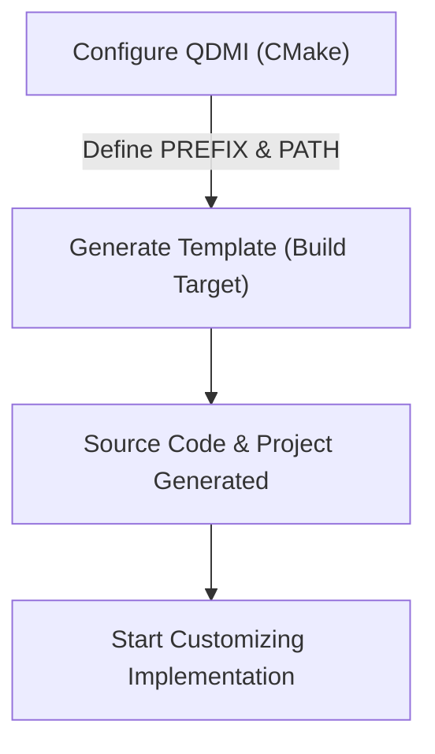
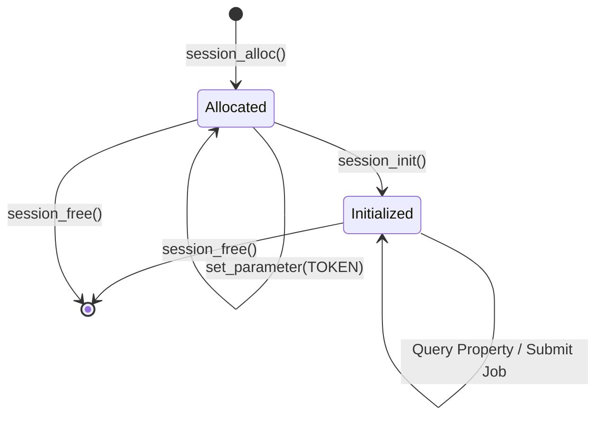
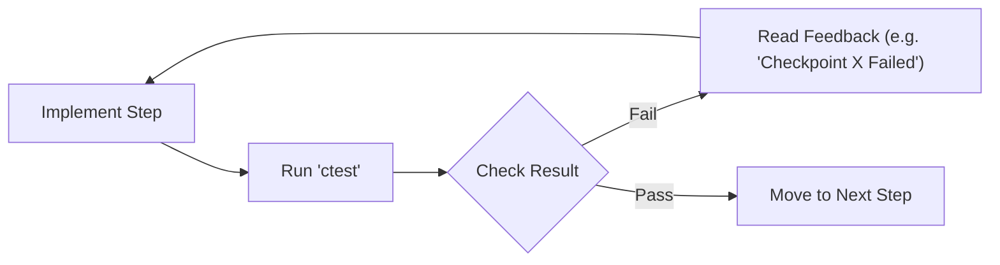

# Tutorial: Implementing a QDMI Device

<!-- IMPORTANT: Keep the line above as the first line. -->

Welcome! This tutorial will guide you through the process of implementing a minimal QDMI device in C++. By the end of this guide, you will have a working device project capable of accepting queries and jobs.

Together with QDMI, we provide a template meant to kick-start the implementation of a new device.
The following sections describe how to set up and use the template.

\tableofcontents

## Prerequisites {#tutorial-prerequisites}

Before you start, ensure you have the following installed on your system:

- **C++ Compiler**: A compiler supporting **C++20** (e.g., GCC 10+, Clang 10+, or MSVC 19.29+).
- **C Compiler**: A compiler supporting **C11**.
- **CMake**: Version **3.24** or higher.
- **Python**: Version **3.10** or higher (required for Python bindings and some build tools).
- **uv** (Optional but recommended): For managing Python dependencies and pre-commit hooks.

## Project Dependencies {#tutorial-dependencies}

When you build the template project, CMake will automatically fetch the following dependencies:

| Dependency                                                         | Version | Purpose                                |
| :----------------------------------------------------------------- | :------ | :------------------------------------- |
| [QDMI Core](https://github.com/Munich-Quantum-Software-Stack/QDMI)  | 1.3.0   | Core interface definitions             |
| [GoogleTest](https://github.com/google/googletest)                 | 1.17.0  | C++ testing framework                  |
| [Doxygen](https://www.doxygen.nl/)                                 | 1.15.0  | Documentation generation               |
| [Doxygen Awesome](https://github.com/jothepro/doxygen-awesome-css) | 2.4.1   | Modern CSS for Doxygen documentation   |
| [scikit-build-core](https://github.com/scikit-build/scikit-build-core) | 0.11.6+ | Python build backend                   |

These dependencies are managed via `FetchContent` in `cmake/ExternalDependencies.cmake` or defined in `pyproject.toml`.

## Creating a new Project {#tutorial-create}

The code for the template is contained in the `templates/` directory of the QDMI repository. To start
a new project based on the template, configure QDMI once to define the prefix and output path, then
explicitly build the `qdmi-template` target that writes the files.

\note An internet connection is needed for this step as the QDMI repository will be fetched from
GitHub.

```sh
cmake -DQDMI_GENERATE_TEMPLATE=ON \
      -DTEMPLATE_PREFIX="PREFIX" \
      -DTEMPLATE_PATH="path/to/dir" \
      -S . -B build

# actually write the template files
cmake --build build --target qdmi-template
```



If the option `TEMPLATE_PATH` is not given, it will be placed in `PREFIX_qdmi_device` relative to the
parent directory where QDMI was cloned.

If you want to regenerate into an existing directory, use:

```sh
cmake --build build --target qdmi-template-clean
```
> [!NOTE]
> The previous command `qdmi-template-force` has been updated to `qdmi-template-clean` to better reflect its function of cleaning and regenerating.

After this step, you can directly start implementing your device in C++.
Example implementations are provided in the `examples/` directory. See
[Examples](examples.md) for more information.

## Configuring the Template {#tutorial-configure}

For stability, we recommend pinning the version of QDMI that you are using for your implementation.
You can use any valid git tag, branch, or commit hash for that. To this end, adjust the `QDMI_REV`
variable in `cmake/ExternalDependencies.cmake` as follows:

```diff
-   set(QDMI_REV "develop"
+   set(QDMI_REV "v1.3.0"
```

When you want to change the prefix after the creation of the template, you need to change the prefix
in a couple of places. All paths are given relative to the root of the template project directory.

- `CMakeLists.txt`
- `src/CMakeLists.txt`: the target name `${QDMI_TARGET_NAME}` (defaults to `prefix-qdmi-device`)
- `src/prefix_device.cpp`: the source file for your device
- `test/test_prefix_device.cpp`: the source file for your tests
- `pyproject.toml`: adapt the package name and several paths
- `python/prefix`: adapt the package namespace in the directory structure
- `python/prefix/qdmi/*.py`: adapt the prefix throughout the package (e.g., `import prefix_qdmi.device`)
- `test/python/*.py`: adapt the prefix throughout the tests
- `docs/index.md` and other documentation files

## Working with the Template {#tutorial-working}

The template is structured into several directories. The top-level
`CMakeLists.txt` contains settings for the entire project. Some additional CMake code that imports
required dependencies is outsourced into `cmake/`.

The most important directory for your implementation is `src/` and the `.cpp` file located in that
directory (e.g., `prefix_device.cpp`). Here you find stubs for all functions that have to be implemented by a device. For every
function, the `return QDMI_ERROR_NOTIMPLEMENTED;` should be replaced by a proper implementation of
the function. In particular, there should not be any computation path at the end that returns \ref
QDMI_ERROR_NOTIMPLEMENTED. Instead, some other error code from \ref QDMI_STATUS should be returned
in case of an erroneous state.

The implementation in the `src/` directory is complemented with a testing framework in `test/`. The
`.cpp` source file (e.g., `test_prefix_device.cpp`) already contains some examples for tests. They are meant to serve as an
inspiration, and more tests should be implemented to cover everything in your device implementation.

The `python` directory in combination with the `pyproject.toml` file contains some basic packaging setup
for distributing the device implementation as a Python package.

The `docs/` directory contains the documentation for the template. This is intended to be used as a
starting point for your own documentation.

Some more files are present in the root directory of the template, such as `LICENSE.md`, `README.md`, and
`.gitignore`.

## Session Handling {#tutorial-session}

To interact with a device, a driver must first establish a session. In QDMI, a session is an opaque handle (`QDMI_Device_Session`) that encapsulates the connection state, including authentication.

The lifecycle of a session follows these steps:
1.  **Allocation**: `QDMI_device_session_alloc` creates a new session object.
2.  **Configuration**: `QDMI_device_session_set_parameter` is used to provide credentials (like an API token).
3.  **Initialization**: `QDMI_device_session_init` validates the parameters and prepares the session for use.
4.  **Usage**: Once initialized, the session handle is passed to querying and job submission functions.
5.  **Clean-up**: `QDMI_device_session_free` releases all resources associated with the session.



### Implementation Example

In your `prefix_device.cpp`, you should define a structure to hold the session state:

```cpp
enum class DEVICE_SESSION_STATUS : uint8_t { ALLOCATED, INITIALIZED };

struct PREFIX_QDMI_Device_Session_impl_d {
  std::string token;
  DEVICE_SESSION_STATUS status = DEVICE_SESSION_STATUS::ALLOCATED;
};
```

Then, implement the core session functions. Here is how you might handle an authentication token and track the session state:

```cpp
int PREFIX_QDMI_device_session_alloc(PREFIX_QDMI_Device_Session *session) {
  if (session == nullptr) return QDMI_ERROR_INVALIDARGUMENT;
  *session = new PREFIX_QDMI_Device_Session_impl_d();
  return QDMI_SUCCESS;
}

int PREFIX_QDMI_device_session_set_parameter(PREFIX_QDMI_Device_Session session,
                                            QDMI_Device_Session_Parameter param,
                                            const size_t size, const void *value) {
  if (session == nullptr || (value != nullptr && size == 0)) return QDMI_ERROR_INVALIDARGUMENT;
  if (session->status != DEVICE_SESSION_STATUS::ALLOCATED) return QDMI_ERROR_BADSTATE;

  if (param == QDMI_DEVICE_SESSION_PARAMETER_TOKEN && value != nullptr) {
    session->token = std::string(static_cast<const char *>(value), size);
    return QDMI_SUCCESS;
  }
  return QDMI_ERROR_NOTSUPPORTED;
}

int PREFIX_QDMI_device_session_init(PREFIX_QDMI_Device_Session session) {
  if (session == nullptr) return QDMI_ERROR_INVALIDARGUMENT;
  if (session->token.empty()) return QDMI_ERROR_PERMISSIONDENIED; // Token is required

  session->status = DEVICE_SESSION_STATUS::INITIALIZED;
  return QDMI_SUCCESS;
}

void PREFIX_QDMI_device_session_free(PREFIX_QDMI_Device_Session session) {
  delete session;
}
```

By requiring a token before initialization, you ensure that only authenticated drivers can query your device or submit jobs.

## Test Environment {#tutorial-testing}

A key part of implementing your QDMI device is verifying each step as you go. The template comes with a built-in test suite tailored to give you immediate feedback, similar to an interactive coding platform.



### Running Verification Tests

The template comes with a basic test suite in `test/test_prefix_device.cpp`. To get the **Checkpoint feedback** described below, update your test suite with the following code. This provides descriptive messages when a specific implementation step is missing or incorrect.

#### Verification Test Suite (`test/test_prefix_device.cpp`)

```cpp
#include "prefix_qdmi/device.h"
#include <gtest/gtest.h>

class QDMIImplementationTest : public ::testing::Test {
protected:
  PREFIX_QDMI_Device_Session session = nullptr;

  void SetUp() override {
    ASSERT_EQ(PREFIX_QDMI_device_initialize(), QDMI_SUCCESS)
        << "Checkpoint 0 Failed: Basic device initialization returned an error.";

    ASSERT_EQ(PREFIX_QDMI_device_session_alloc(&session), QDMI_SUCCESS)
        << "Checkpoint 1 Failed: Could not allocate a session handle.";

    // Provide a dummy token for initialization, reflecting the Session Handling step.
    const std::string dummy_token = "tutorial_token";
    ASSERT_EQ(PREFIX_QDMI_device_session_set_parameter(
                  session, QDMI_DEVICE_SESSION_PARAMETER_TOKEN,
                  dummy_token.size(), dummy_token.c_str()),
              QDMI_SUCCESS)
        << "Checkpoint 2 Failed: Could not set the authentication token. "
           "Did you implement QDMI_DEVICE_SESSION_PARAMETER_TOKEN?";

    ASSERT_EQ(PREFIX_QDMI_device_session_init(session), QDMI_SUCCESS)
        << "Checkpoint 2 Failed: Session initialization failed. "
           "Common causes: Token validation logic error or device is offline.";
  }

  void TearDown() override { PREFIX_QDMI_device_finalize(); }
};

TEST_F(QDMIImplementationTest, QueryDeviceQubitNum) {
  size_t num_qubits = 0;
  EXPECT_EQ(PREFIX_QDMI_device_session_query_device_property(
                session, QDMI_DEVICE_PROPERTY_QUBITSNUM, sizeof(size_t),
                &num_qubits, nullptr),
            QDMI_SUCCESS)
      << "Checkpoint 3 Failed: Your device must report the number of available qubits.";
}
```

#### Run All Tests
To check your overall progress:
```sh
ctest --test-dir build --output-on-failure
```

#### Verification Checkpoints
If a test fails, it will provide a descriptive "Checkpoint" message to help you identify what's missing:

| Checkpoint | Target Feature | What it verifies |
| :--- | :--- | :--- |
| **0** | Device Init | Basic `QDMI_device_initialize` implementation. |
| **1** | Session Alloc | Successful `QDMI_device_session_alloc` and memory management. |
| **2** | Authentication | Implementation of token handling in `set_parameter` and `init`. |
| **3** | Device Properties | Queries for device name, version, and qubit count. |

### Understanding the Feedback
When a test fails, pay close attention to the custom failure messages. They are designed to point you toward the specific function or logic error in your code. For example:
> `Checkpoint 2 Failed: Could not set the authentication token.`
> `Did you implement QDMI_DEVICE_SESSION_PARAMETER_TOKEN?`

As you implement each function described in this tutorial, keep the test suite running to ensure you stay on the right track!

## Building the Template and Running the Tests {#tutorial-building}

All following commands are meant to be executed from the root directory of the template. After
configuring your project (see [Configuring the Template](#tutorial-configure)), you can build your
project with the following command:

```sh
cmake -S . -B build -DCMAKE_BUILD_TYPE=Release
cmake --build build --config Release
```

If you only want to build a specific target, you can append, for example,
`--target prefix-qdmi-device-test` to the command above, which will build the tests. If you only want to
build the device implementation, you can use `--target prefix-qdmi-device`.

To run the tests, perform the following command:

```sh
ctest --test-dir build
```

For more details on the development process, also check out the [Development Guide](guide.md).
