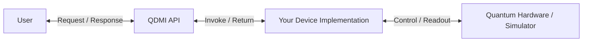
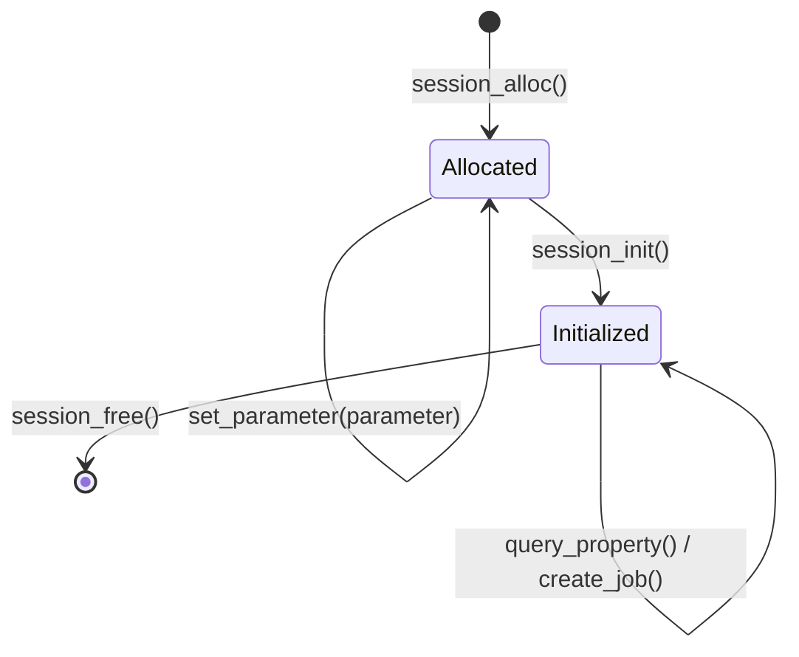
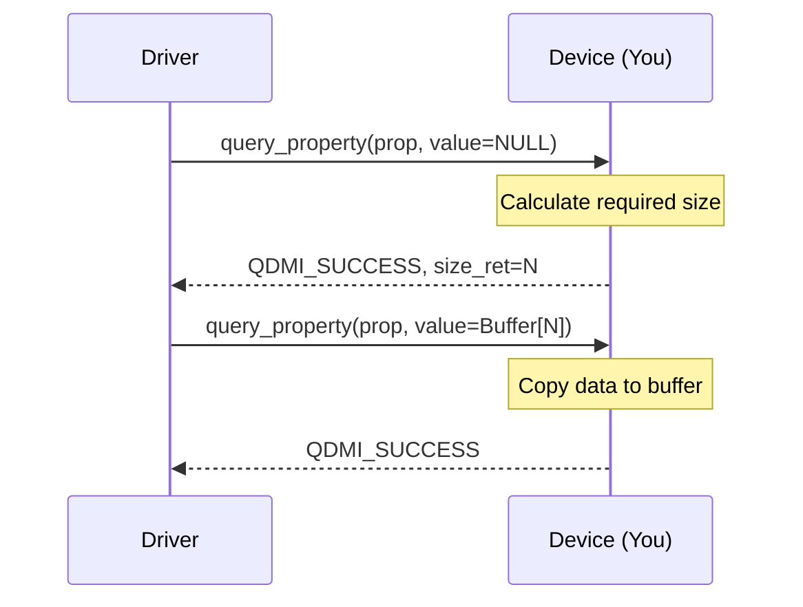
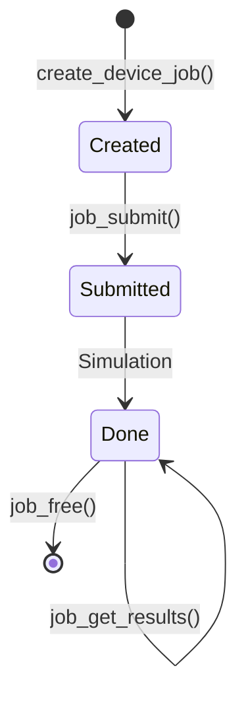

# Tutorial: Implementing a QDMI Device

This guide walks you through implementing a minimal **QDMI device**. By the end of this tutorial, you'll have a functional implementation capable of handling simulated quantum workloads. We've designed this as an interactive walkthrough where you build and verify features incrementally.

The **Quantum Device Management Interface (QDMI)** is a standardized layer for hardware abstraction. We're building a bridge that allows high-level drivers to control your device implementation through a stable C interface.



### Your Progress Journey

- [ ] **Phase 1**: [Project Creation](#tutorial-create)
- [ ] **Phase 2**: [Global Lifecycle](#tutorial-global)
- [ ] **Phase 3**: [Session Handling](#tutorial-session)
- [ ] **Phase 4**: [Device Properties](#tutorial-query)
- [ ] **Phase 5**: [Job Execution](#tutorial-jobs)

## Prerequisites {#tutorial-prerequisites}

The template requires a few standard development tools:

- **C++ Compiler**: Supporting C++20 (GCC 10+, Clang 10+, or MSVC 19.29+).
- **C Compiler**: Supporting C11 (this requirement is covered by the recommended options above).
- **CMake**: Version 3.24 or higher.
- **Python**: Version 3.10 or higher (we recommend using [uv](https://docs.astral.sh/uv/) for fast Python installations).

CMake handles fetching all other dependencies, such as the QDMI core interface and the GoogleTest framework, during the configuration step. Note that this step requires an active internet connection.

## Phase 1 — Project Setup {#tutorial-create}

First, we'll generate the project workspace using the QDMI template. This requires setting a prefix that is used within the template. For this guide, we'll use `tutorial` as our project prefix.

```sh
# Step 1: Clone the QDMI repository
git clone https://github.com/Munich-Quantum-Software-Stack/QDMI.git
cd QDMI

# Step 2: Generate the project files
cmake -DQDMI_GENERATE_TEMPLATE=ON \
      -DTEMPLATE_PREFIX="tutorial" \
      -DTEMPLATE_PATH="tutorial" \
      -S . -B build

# Step 3: Actually write the files to disk
cmake --build build --target qdmi-template

# Step 4: Enter the new project directory
cd tutorial
```

The resulting directory (`my_qdmi_device`) follows a standard structure:

```text
.
├── src/                # Your implementation (tutorial_device.cpp)
├── test/               # Your tests (test_tutorial_device.cpp)
├── cmake/              # Build logic
├── CMakeLists.txt      # Main project file
└── pyproject.toml      # Python configuration
```

### The Verification Loop

We use a simple verification loop to track progress: you'll set up the tests first, confirm they fail, implement the fix, and then verify the results.

**Action Required**: Copy the full test suite from the [Test Suite Reference](#tutorial-test-reference) section at the bottom of this page and paste it into `test/test_tutorial_device.cpp` now.
*(Alternatively, you can automatically inject this test suite during project generation by passing `-DTEMPLATE_TEST_SUITE=ON` to the CMake configuration step.)*

Building the tests at this stage should result in failures, which is expected as we haven't implemented the logic yet.

```sh
# Build the test target
cmake -S . -B build -DCMAKE_BUILD_TYPE=Release
cmake --build build --target tutorial-qdmi-device-test

# Run the tests
ctest --test-dir build -C Release
```

> [!TIP]
> **Progress Check**: Starting with failures is expected—we'll address these one by one as we implement the required functions.

## Phase 2 — Global Device Lifecycle {#tutorial-global}

> [!NOTE]
> **Before writing any implementation code**, ensure `src/tutorial_device.cpp`
> starts with these includes. They provide the core interface, string handling,
> and memory utilities used throughout the implementation:
>
> ```cpp
> #include "tutorial_qdmi/device.h"
> #include <string>    // For std::string
> #include <cstring>   // For std::memcpy
> #include <stdexcept> // For std::bad_alloc
> ```

The driver interacts with your device starting with `initialize` and ending with `finalize`. In a real implementation, this is where you'd typically connect to physical hardware or allocate runtime resources; for this tutorial, we'll keep the logic minimal.

Open `src/tutorial_device.cpp` and update these stubs to return `QDMI_SUCCESS`.

```cpp
int tutorial_QDMI_device_initialize() {
  // Global startup logic (e.g., hardware connection) goes here
  return QDMI_SUCCESS;
}

int tutorial_QDMI_device_finalize() {
  // Global cleanup logic goes here
  return QDMI_SUCCESS;
}
```

> [!TIP]
> **Check Now**:
> Run the tests again. **Checkpoint Init** should now pass.
> `ctest --test-dir build -C Release -R "Init"`

## Phase 3 — Session Handling {#tutorial-session}

Once the global interface is ready, we need a way to manage connections. This is handled through a **@ref QDMI_Device_Session "Session"**.

In QDMI, sessions are managed via **handles**. A handle is essentially an opaque pointer to a struct that your implementation defines. Specifically, `tutorial_QDMI_Device_Session` is a typedef from the C API, while the internal struct (`tutorial_QDMI_Device_Session_impl_d`) is a private implementation detail.



### 1. Define the Session

Define a basic struct in `src/tutorial_device.cpp` to track the session state.

> [!NOTE]
> Using a private C++ struct to hold session state helps keep the public C interface stable and avoids ABI versioning headaches between your implementation and the driver.

```cpp
enum class SESSION_STATUS { ALLOCATED, INITIALIZED };

struct tutorial_QDMI_Device_Session_impl_d {
  std::string token;
  SESSION_STATUS status = SESSION_STATUS::ALLOCATED;
};
```

### 2. Implement the Logic

Implement the session management functions. We include safety checks here to ensure the implementation is robust against null handles.

```cpp
int tutorial_QDMI_device_session_alloc(tutorial_QDMI_Device_Session *session) {
  if (session == nullptr) return QDMI_ERROR_INVALIDARGUMENT;

  try {
    *session = new tutorial_QDMI_Device_Session_impl_d();
    return QDMI_SUCCESS;
  } catch (const std::bad_alloc&) {
    return QDMI_ERROR_OUTOFMEM;
  }
}

int tutorial_QDMI_device_session_set_parameter(tutorial_QDMI_Device_Session session,
                                            QDMI_Device_Session_Parameter param,
                                            const size_t size, const void *value) {
  if (session == nullptr) return QDMI_ERROR_INVALIDARGUMENT;
  if (value != nullptr && size == 0) return QDMI_ERROR_INVALIDARGUMENT;

  // In this tutorial we only support the TOKEN parameter.
  // In a real device you can handle additional parameters (e.g. proxy settings,
  // timeout values, etc.) by adding further cases here.
  if (param == QDMI_DEVICE_SESSION_PARAMETER_TOKEN && value != nullptr) {
    session->token = std::string(static_cast<const char*>(value), size);
    return QDMI_SUCCESS;
  }
  return QDMI_ERROR_NOTSUPPORTED;
}

int tutorial_QDMI_device_session_init(tutorial_QDMI_Device_Session session) {
  if (session == nullptr) return QDMI_ERROR_INVALIDARGUMENT;

  // Note: Requiring a TOKEN is a design choice for this tutorial implementation,
  // as QDMI remains flexible about how hardware providers handle authentication.
  if (session->token.empty()) return QDMI_ERROR_PERMISSIONDENIED;

  session->status = SESSION_STATUS::INITIALIZED;
  return QDMI_SUCCESS;
}

void tutorial_QDMI_device_session_free(tutorial_QDMI_Device_Session session) {
  if (session != nullptr) delete session;
}
```

> [!TIP]
> **Check Now**:
> With the handshake logic in place, you can now verify session handling. **Checkpoints 1 and 2** should pass.
> `ctest --test-dir build -C Release -R "Alloc|Init"`

## Phase 4 — First Query (Device Properties) {#tutorial-query}

The driver uses properties to retrieve information about your device, such as its name or qubit count. Since this data can vary in length, we use a **Two-Step Query Pattern**.



> [!NOTE]
> While we use two steps for safety, QDMI also allows retrieving data in a single call if the driver already knows the correct size or provides a sufficiently large buffer.

### Implementing the Queries

Define the device constants and implement the query function in `src/tutorial_device.cpp`.

> [!NOTE]
> This switch-based pattern is standard in QDMI. It looks a bit verbose, but it's efficient and prevents the driver from needing to know your implementation's internal memory layout.

```cpp
const std::string DEVICE_NAME = "MyTutorialDevice";
const size_t QUBIT_COUNT = 1;

int tutorial_QDMI_device_session_query_device_property(
    tutorial_QDMI_Device_Session session, const QDMI_Device_Property prop,
    const size_t size, void *value, size_t *size_ret) {

  if (session == nullptr) return QDMI_ERROR_INVALIDARGUMENT;
  if (session->status != SESSION_STATUS::INITIALIZED) return QDMI_ERROR_BADSTATE;

  switch (prop) {
    case QDMI_DEVICE_PROPERTY_NAME: {
      // `+1` to also include the `\0` at the end of the string
      size_t name_size = DEVICE_NAME.size() + 1;
      if (size_ret) {
        *size_ret = name_size;
      }
      if (value != nullptr) {
        if (size < name_size || size == 0) {
          return QDMI_ERROR_INVALIDARGUMENT;
        }
        std::memcpy(value, DEVICE_NAME.c_str(), name_size);
      }
      return QDMI_SUCCESS;
    }
    case QDMI_DEVICE_PROPERTY_SITES: {
      if (size_ret) *size_ret = sizeof(size_t);
      if (value == nullptr) return QDMI_SUCCESS;

      if (size < sizeof(size_t) || size == 0) return QDMI_ERROR_INVALIDARGUMENT;
      *static_cast<size_t*>(value) = QUBIT_COUNT;
      return QDMI_SUCCESS;
    }
    default: return QDMI_ERROR_NOTSUPPORTED;
  }
}
```

> [!NOTE]
> For a more advanced approach that uses macros to reduce boilerplate code when defining multiple properties, refer to the [Example Device Implementation](https://github.com/Munich-Quantum-Software-Stack/QDMI/tree/develop/examples/device).

> [!TIP]
> **Check Now**:
> The device can now describe itself to the driver. **Checkpoints Init, 1, 2, and 3** should all pass.
> `ctest --test-dir build -C Release`

## Phase 5 — Job Handling {#tutorial-jobs}

Quantum programs are managed via **Jobs**. Jobs follow a specific lifecycle, moving from creation to submission and eventually to completion.



### 1. Define the Job

Add a simple struct for tracking job state in `src/tutorial_device.cpp`.

```cpp
struct tutorial_QDMI_Device_Job_impl_d {
  std::string program;
  QDMI_Job_Status status = QDMI_JOB_STATUS_CREATED;
};
```

### 2. Implement Job Logic

The following functions handle creating and executing jobs. In this tutorial, we simulate immediate successful completion.

```cpp
int tutorial_QDMI_device_session_create_device_job(tutorial_QDMI_Device_Session session,
                                                tutorial_QDMI_Device_Job *job) {
  if (session == nullptr || job == nullptr) return QDMI_ERROR_INVALIDARGUMENT;
  try {
    *job = new tutorial_QDMI_Device_Job_impl_d();
    return QDMI_SUCCESS;
  } catch (const std::bad_alloc&) {
    return QDMI_ERROR_OUTOFMEM;
  }
}

int tutorial_QDMI_device_job_set_parameter(tutorial_QDMI_Device_Job job,
                                        const QDMI_Device_Job_Parameter param,
                                        const size_t size, const void *value) {
  if (job == nullptr || value == nullptr || size == 0) return QDMI_ERROR_INVALIDARGUMENT;

  if (param == QDMI_DEVICE_JOB_PARAMETER_PROGRAM) {
    job->program = std::string(static_cast<const char*>(value), size);
    return QDMI_SUCCESS;
  }
  return QDMI_ERROR_NOTSUPPORTED;
}

int tutorial_QDMI_device_job_submit(tutorial_QDMI_Device_Job job) {
  if (job == nullptr) return QDMI_ERROR_INVALIDARGUMENT;
  if (job->program.empty()) return QDMI_ERROR_BADSTATE;

  if (job->status != QDMI_JOB_STATUS_CREATED) return QDMI_ERROR_BADSTATE;

  // Real hardware implementations often use asynchronous execution with
  // states like QUEUED or RUNNING. Here, we simulate immediate completion.
  job->status = QDMI_JOB_STATUS_DONE;
  return QDMI_SUCCESS;
}

int tutorial_QDMI_device_job_check(tutorial_QDMI_Device_Job job, QDMI_Job_Status *status) {
  if (job == nullptr || status == nullptr) return QDMI_ERROR_INVALIDARGUMENT;
  *status = job->status;
  return QDMI_SUCCESS;
}

int tutorial_QDMI_device_job_get_results(tutorial_QDMI_Device_Job job,
                                      QDMI_Job_Result result, const size_t size,
                                      void *data, size_t *size_ret) {
  if (job == nullptr) return QDMI_ERROR_INVALIDARGUMENT;
  if (job->status != QDMI_JOB_STATUS_DONE) return QDMI_ERROR_BADSTATE;

  if (result == QDMI_JOB_RESULT_PROBABILITIES_DENSE) {
    const double probs[] = {0.5, 0.5};
    size_t res_size = sizeof(probs);

    if (size_ret) *size_ret = res_size;
    if (data == nullptr) return QDMI_SUCCESS;

    if (size < res_size) return QDMI_ERROR_INVALIDARGUMENT;
    std::memcpy(data, probs, res_size);
    return QDMI_SUCCESS;
  }
  return QDMI_ERROR_NOTSUPPORTED;
}

void tutorial_QDMI_device_job_free(tutorial_QDMI_Device_Job job) {
  if (job != nullptr) delete job;
}
```

> [!TIP]
> **Check Now**:
> The core implementation is now complete. **Checkpoint 4** should pass.
> `ctest --test-dir build -C Release -R "Submit"`

## Test Suite Reference {#tutorial-test-reference}

This is the full verification suite for `test/test_tutorial_device.cpp`, which provides the checkpoints used in this guide.

```cpp
#include "tutorial_qdmi/device.h"
#include <gtest/gtest.h>

class QDMIBaseTest : public ::testing::Test {
protected:
  void SetUp() override {
    ASSERT_EQ(tutorial_QDMI_device_initialize(), QDMI_SUCCESS)
        << "Checkpoint Init Failed: Basic device initialization returned an error.";
  }
  void TearDown() override { tutorial_QDMI_device_finalize(); }
};

class QDMISessionTest : public QDMIBaseTest {
protected:
  tutorial_QDMI_Device_Session session = nullptr;
  void SetUp() override {
    QDMIBaseTest::SetUp();
    ASSERT_EQ(tutorial_QDMI_device_session_alloc(&session), QDMI_SUCCESS)
        << "Checkpoint 1 Failed: Could not allocate a session handle.";
  }
  void TearDown() override {
    if (session) tutorial_QDMI_device_session_free(session);
    QDMIBaseTest::TearDown();
  }
};

class QDMIInitializedSessionTest : public QDMISessionTest {
protected:
  void SetUp() override {
    QDMISessionTest::SetUp();
    const std::string token = "tutorial_token";
    ASSERT_EQ(tutorial_QDMI_device_session_set_parameter(session, QDMI_DEVICE_SESSION_PARAMETER_TOKEN, token.size(), token.c_str()), QDMI_SUCCESS);
    ASSERT_EQ(tutorial_QDMI_device_session_init(session), QDMI_SUCCESS)
        << "Checkpoint 2 Failed: Session initialization failed.";
  }
};

TEST_F(QDMIBaseTest, Initialization) {
  // Checkpoint Init: Verified by SetUp/TearDown
}

TEST_F(QDMISessionTest, Allocation) {
  // Checkpoint 1: Verified by SetUp/TearDown
}

TEST_F(QDMIInitializedSessionTest, Initialization) {
  // Checkpoint 2: Verified by SetUp/TearDown
}

TEST_F(QDMISessionTest, QueryBeforeInit) {
  // Querying properties on an uninitialised session must return BADSTATE
  size_t size = 0;
  EXPECT_EQ(tutorial_QDMI_device_session_query_device_property(
                session, QDMI_DEVICE_PROPERTY_NAME, 0, nullptr, &size),
            QDMI_ERROR_BADSTATE);
}

TEST_F(QDMIInitializedSessionTest, QueryProperties) {
  size_t size = 0;

  // Null session must return INVALIDARGUMENT
  EXPECT_EQ(tutorial_QDMI_device_session_query_device_property(nullptr, QDMI_DEVICE_PROPERTY_NAME, 0, nullptr, &size), QDMI_ERROR_INVALIDARGUMENT);

  // First call: retrieve the required buffer size
  ASSERT_EQ(tutorial_QDMI_device_session_query_device_property(session, QDMI_DEVICE_PROPERTY_NAME, 0, nullptr, &size), QDMI_SUCCESS)
      << "Checkpoint 3 Failed: Device failed to report name size.";

  // Buffer too small must return INVALIDARGUMENT
  std::string small_buffer(size > 1 ? size - 1 : 0, '\0');
  if (size > 1) {
    EXPECT_EQ(tutorial_QDMI_device_session_query_device_property(session, QDMI_DEVICE_PROPERTY_NAME, small_buffer.size(), small_buffer.data(), nullptr), QDMI_ERROR_INVALIDARGUMENT);
  }

  // Second call: retrieve the actual name
  std::string value(size, '\0');
  ASSERT_EQ(tutorial_QDMI_device_session_query_device_property(session, QDMI_DEVICE_PROPERTY_NAME, size, value.data(), nullptr), QDMI_SUCCESS);
  EXPECT_GT(value.size(), 0) << "Checkpoint 3 Failed: Name should not be empty.";

  // Unsupported property must return NOTSUPPORTED
  EXPECT_EQ(tutorial_QDMI_device_session_query_device_property(session, QDMI_DEVICE_PROPERTY_MAX, 0, nullptr, &size), QDMI_ERROR_NOTSUPPORTED);
}

TEST_F(QDMIInitializedSessionTest, SubmitAndSimulateJob) {
  tutorial_QDMI_Device_Job job = nullptr;

  // Null session must return INVALIDARGUMENT
  EXPECT_EQ(tutorial_QDMI_device_session_create_device_job(nullptr, &job), QDMI_ERROR_INVALIDARGUMENT);
  // Null job-pointer must return INVALIDARGUMENT
  EXPECT_EQ(tutorial_QDMI_device_session_create_device_job(session, nullptr), QDMI_ERROR_INVALIDARGUMENT);

  ASSERT_EQ(tutorial_QDMI_device_session_create_device_job(session, &job), QDMI_SUCCESS)
      << "Checkpoint 4 Failed: Could not create a device job.";

  const std::string qasm = "OPENQASM 2.0; qreg q[1]; h q[0];";

  // Null job must return INVALIDARGUMENT
  EXPECT_EQ(tutorial_QDMI_device_job_set_parameter(nullptr, QDMI_DEVICE_JOB_PARAMETER_PROGRAM, qasm.size(), qasm.c_str()), QDMI_ERROR_INVALIDARGUMENT);
  // Null value with size==0 must return INVALIDARGUMENT
  EXPECT_EQ(tutorial_QDMI_device_job_set_parameter(job, QDMI_DEVICE_JOB_PARAMETER_PROGRAM, 0, nullptr), QDMI_ERROR_INVALIDARGUMENT);
  // Unsupported parameter must return NOTSUPPORTED
  EXPECT_EQ(tutorial_QDMI_device_job_set_parameter(job, QDMI_DEVICE_JOB_PARAMETER_MAX, qasm.size(), qasm.c_str()), QDMI_ERROR_NOTSUPPORTED);

  // Submitting without a program set must return BADSTATE
  EXPECT_EQ(tutorial_QDMI_device_job_submit(job), QDMI_ERROR_BADSTATE);

  ASSERT_EQ(tutorial_QDMI_device_job_set_parameter(job, QDMI_DEVICE_JOB_PARAMETER_PROGRAM, qasm.size(), qasm.c_str()), QDMI_SUCCESS);

  // Null job must return INVALIDARGUMENT
  EXPECT_EQ(tutorial_QDMI_device_job_submit(nullptr), QDMI_ERROR_INVALIDARGUMENT);

  ASSERT_EQ(tutorial_QDMI_device_job_submit(job), QDMI_SUCCESS)
      << "Checkpoint 4 Failed: Job submission failed.";

  // Re-submission after completion must return BADSTATE
  EXPECT_EQ(tutorial_QDMI_device_job_submit(job), QDMI_ERROR_BADSTATE);

  QDMI_Job_Status status;
  // Null job must return INVALIDARGUMENT
  EXPECT_EQ(tutorial_QDMI_device_job_check(nullptr, &status), QDMI_ERROR_INVALIDARGUMENT);
  // Null status pointer must return INVALIDARGUMENT
  EXPECT_EQ(tutorial_QDMI_device_job_check(job, nullptr), QDMI_ERROR_INVALIDARGUMENT);
  ASSERT_EQ(tutorial_QDMI_device_job_check(job, &status), QDMI_SUCCESS);
  EXPECT_EQ(status, QDMI_JOB_STATUS_DONE);

  double probs[2];
  // Null job must return INVALIDARGUMENT
  EXPECT_EQ(tutorial_QDMI_device_job_get_results(nullptr, QDMI_JOB_RESULT_PROBABILITIES_DENSE, sizeof(probs), probs, nullptr), QDMI_ERROR_INVALIDARGUMENT);
  // Buffer too small must return INVALIDARGUMENT
  EXPECT_EQ(tutorial_QDMI_device_job_get_results(job, QDMI_JOB_RESULT_PROBABILITIES_DENSE, sizeof(probs) - 1, probs, nullptr), QDMI_ERROR_INVALIDARGUMENT);
  // Unsupported result type must return NOTSUPPORTED
  EXPECT_EQ(tutorial_QDMI_device_job_get_results(job, QDMI_JOB_RESULT_MAX, sizeof(probs), probs, nullptr), QDMI_ERROR_NOTSUPPORTED);

  ASSERT_EQ(tutorial_QDMI_device_job_get_results(job, QDMI_JOB_RESULT_PROBABILITIES_DENSE, sizeof(probs), probs, nullptr), QDMI_SUCCESS)
      << "Checkpoint 4 Failed: Could not retrieve simulated job results.";

  tutorial_QDMI_device_job_free(job);
}
```

### Verification Checkpoints

| Checkpoint | Milestone     | Verification Target                               |
| :--------- | :------------ | :------------------------------------------------ |
| **Init**   | Global Init   | `device_initialize` returns `QDMI_SUCCESS`.       |
| **1**      | Session Alloc | `session_alloc` creates a valid pointer.          |
| **2**      | Session Init  | `session_init` accepts token and starts session.  |
| **3**      | First Query   | `query_device_property` returns the correct name. |
| **4**      | Job Handling  | `job_submit` runs and results are returned.       |

### Status Code Reference

| Status Code                   | Meaning                                                                         |
| :---------------------------- | :------------------------------------------------------------------------------ |
| `QDMI_SUCCESS`                | The operation was successful.                                                   |
| `QDMI_ERROR_NOTIMPLEMENTED`   | This feature hasn't been implemented yet. Replace the template stubs.           |
| `QDMI_ERROR_INVALIDARGUMENT`  | Invalid parameter (e.g., NULL pointer or insufficient buffer).                  |
| `QDMI_ERROR_PERMISSIONDENIED` | Authentication failed (e.g., missing or invalid token).                         |
| `QDMI_ERROR_NOTSUPPORTED`     | The requested property or feature is not supported by this device.              |
| `QDMI_ERROR_BADSTATE`         | Function called in an incorrect order (e.g., submitting before initialization). |
| `QDMI_ERROR_OUTOFMEM`         | Memory allocation failed.                                                       |

### Debugging Tips

- **Check failure messages**: Test failures include checkpoint messages pointing to the relevant guide section.
- **Detailed output**: Use `ctest --output-on-failure` to see full execution logs.
- **Stub verification**: Ensure you have removed all `QDMI_ERROR_NOTIMPLEMENTED` returns from implemented logic.

## Summary and Next Steps {#tutorial-next-steps}

Congratulations on building your first QDMI device. You've implemented:

1.  **Lifecycle Management**: Handling global and session-level initialization.
2.  **Opaque Data Retrieval**: Mastering the two-step pattern for variable-sized data.
3.  **Job Orchestration**: Moving tasks through a standardized lifecycle.

**What's next?**

- **Hardware Integration**: Replace simulated results with calls to your quantum controller's C/C++ API.
- **Extended Queries**: Add more device properties such as gate fidelities or coupling maps.

---

## Appendix {#tutorial-appendix}

### Configuring the Template

We recommend pinning your project to a specific QDMI release for stability. Edit `cmake/ExternalDependencies.cmake`:

```diff
-   set(QDMI_REV "develop")
+   set(QDMI_REV "v1.3.0")
```

### Troubleshooting Fetch Failures

- **GitHub Rate Limits**: If you encounter 403 errors, set a `GITHUB_TOKEN` environment variable and CMake will use it for authentication.
- **SSL Certificates**: Update your system certificates if the HTTPS fetch fails.
- **Missing Tools**: Ensure `git` and `cmake` are available in your path.

### Build Configuration

- **Debug Configuration**: Use `-DCMAKE_BUILD_TYPE=Debug` during configuration for better stack traces.
- **Targeted Build**: Build specific components using `--target tutorial-qdmi-device` to save time.
- **Speed up builds**: We recommend installing `ccache` to significantly speed up recompilations.
